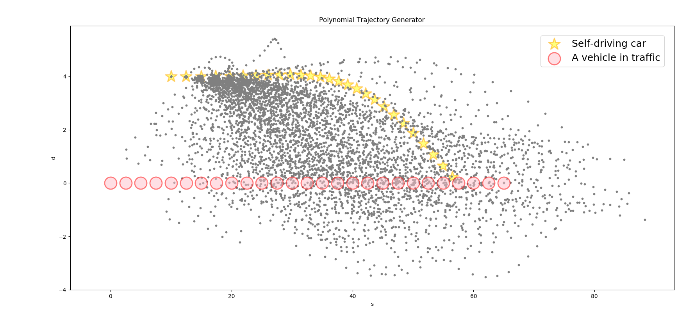

# Polynomial-Trajectory-Generator

## File Descriptions

- `ptg.py` - *The primary code for generating a polynomial trajectory for some constraints.*
  > This is also where weights are assigned to cost functions.
    Adjusting these weights (and possibly adding new cost functions), can have a big effect on vehicle behavior.
- `cost_functions.py` - *This file contains many cost functions which are used in ptg.py when selecting the best trajectory.*
  > Some cost functions aren't yet implemented...
- `evaluate_ptg.py` - *This file sets a start state, goal, and traffic conditions and runs the PTG code.*
  > Feel free to modify the goal, add traffic, etc... to test your vehicle's trajectory generation ability.
- `constants.py` - *constants like speed limit, vehicle size, etc...*
- `helpers.py` - *helper functions used by other files.*

## Getting Started
From the project's directory, run `python evaluate_ptg.py`. You should see a plot similar to the one below.This plot shows the s (x-axis) and d(y-axis) trajectories followed by a vehicle in traffic (red circle) and a self driving car (yellow star). In this situation, the self driving car was trying to get behind the target vehicle by estimate all potential path (grey dot).

<div align="center">
  </a>
</div>


Best cost :

 |FUNCTION                        | Value           | Weight  |
 |--------------------------------|---------------- |:-------:|
 |time_diff_cost                  | +0.15           |1        |
 |s_diff_cost                     | -5.05           |4        |
 |d_diff_cost                     | +1.70           |2        |
 |collision_cost                  | +0.00           |10       |
 |buffer_cost                     | +0.42           |1        |
 |exceeds_speed_limit_cost        | +0.56           |1        |
 |efficiency_cost                 | +0.15           |1        |
 |total_accel_cost                | +0.42           |1        |
 |max_accel_cost                  | +0.00           |1        |
 |max_jerk_cost                   | +0.00           |1        |
 |total_jerk_cost                 | +0.20           |1        |

## Cost Functions

```python
def time_diff_cost(traj, target_vehicle, delta, T, predictions):
    """
    Penalizes trajectories that span a duration which is longer or
    shorter than the duration requested.
    """
    _, _, t = traj

    return logistic(float(abs(t-T)) / T)
```

```python
def s_diff_cost(traj, target_vehicle, delta, T, predictions):
    """
    Penalizes trajectories whose s coordinate (and derivatives)
    differ from the goal.
    """
    s, _, T = traj
    target  = predictions[target_vehicle].state_in(T)
    target  = list(np.array(target) + np.array(delta))
    s_targ  = target[:3]
    S       = [f(T) for f in get_f_and_N_derivatives(s, 2)]
    cost    = 0

    for actual, expected, sigma in zip(S, s_targ, SIGMA_S):
        #diff  = float(abs(actual-expected))
        diff  = float(actual-expected)
        cost += logistic(diff/sigma)

    return cost
```

```python
def d_diff_cost(traj, target_vehicle, delta, T, predictions):
    """
    Penalizes trajectories whose d coordinate (and derivatives)
    differ from the goal.
    """
    _, d_coeffs, T = traj
    d_dot_coeffs   = differentiate(d_coeffs)
    d_ddot_coeffs  = differentiate(d_dot_coeffs)

    d      = to_equation(d_coeffs)
    d_dot  = to_equation(d_dot_coeffs)
    d_ddot = to_equation(d_ddot_coeffs)

    D = [d(T), d_dot(T), d_ddot(T)]

    target = predictions[target_vehicle].state_in(T)
    target = list(np.array(target) + np.array(delta))
    d_targ = target[3:]
    cost   = 0

    for actual, expected, sigma in zip(D, d_targ, SIGMA_D):
        diff  = float(abs(actual-expected))
        cost += logistic(diff/sigma)

    return cost
```

```python
def collision_cost(traj, target_vehicle, delta, T, predictions):
    """
    Binary cost function which penalizes collisions.
    """
    nearest = nearest_approach_to_any_vehicle(traj, predictions)

    if nearest < 2*VEHICLE_RADIUS: return 1.0
    else : return 0.0
```

```python
def buffer_cost(traj, target_vehicle, delta, T, predictions):
    """
    Penalizes getting close to other vehicles.
    """
    nearest = nearest_approach_to_any_vehicle(traj, predictions)

    factor  = 2 * VEHICLE_RADIUS / nearest

    return logistic(factor)
```

```python
def stays_on_road_cost(traj, target_vehicle, delta, T, predictions):
    pass
```

```python
def exceeds_speed_limit_cost(traj, target_vehicle, delta, T, predictions):

    s, _, t = traj
    s       = to_equation(s)
    v       = float(s(t)) / t

    target_speed = 0.95 * SPEED_LIMIT
    stop_cost    = 0.8
    if v < target_speed:

        cost = stop_cost * ((target_speed- v)/target_speed)

    return cost
    #pass
```

```python
def efficiency_cost(traj, target_vehicle, delta, T, predictions):
    """
    Rewards high average speeds.
    """
    s, _, t = traj
    s       = to_equation(s)
    avg_v   = float(s(t)) / t

    targ_s, _, _, _, _, _ = predictions[target_vehicle].state_in(t)
    targ_v                = float(targ_s) / t

    return logistic(2*float(targ_v - avg_v) / avg_v)
```

```python
def total_accel_cost(traj, target_vehicle, delta, T, predictions):

    s, d, t = traj
    s_dot   = differentiate(s)
    s_d_dot = differentiate(s_dot)

    a         = to_equation(s_d_dot)
    total_acc = 0
    dt        = float(T) / 100.0

    for i in range(100):
        t          = dt * i
        acc        = a(t)
        total_acc += abs(acc*dt)
    acc_per_second = total_acc / T

    return logistic(acc_per_second / EXPECTED_ACC_IN_ONE_SEC )
```

```python
def max_accel_cost(traj, target_vehicle, delta, T, predictions):

    s, d, t  = traj
    s_dot    = differentiate(s)
    s_d_dot  = differentiate(s_dot)

    a        = to_equation(s_d_dot)
    all_accs = [a(float(T)/100 * i) for i in range(100)]
    max_acc  = max(all_accs, key=abs)

    if abs(max_acc) > MAX_ACCEL: return 1
    else: return 0
```

```python
def max_jerk_cost(traj, target_vehicle, delta, T, predictions):

    s, d, t   = traj
    s_dot     = differentiate(s)
    s_d_dot   = differentiate(s_dot)

    jerk      = differentiate(s_d_dot)
    jerk      = to_equation(jerk)
    all_jerks = [jerk(float(T)/100 * i) for i in range(100)]
    max_jerk  = max(all_jerks, key=abs)

    if abs(max_jerk) > MAX_JERK: return 1
    else: return 0
```

```python
def total_jerk_cost(traj, target_vehicle, delta, T, predictions):

    s, d, t    = traj
    s_dot      = differentiate(s)
    s_d_dot    = differentiate(s_dot)
    jerk       = to_equation(differentiate(s_d_dot))

    total_jerk = 0
    dt         = float(T) / 100.0
    for i in range(100):
        t = dt * i
        j = jerk(t)
        total_jerk += abs(j*dt)

    jerk_per_second = total_jerk / T

    return logistic(jerk_per_second / EXPECTED_JERK_IN_ONE_SEC )
```
